# Cybersecurity Threat Detection 

## 🌟 Overview
This project involves building and deploying a **Cybersecurity Threat Detection System using Amazon SageMaker**. The system identifies anomalous network activity that may indicate cyberattacks, such as DDoS attacks, unauthorized access, or phishing attempts. The machine learning pipeline automates data ingestion, preprocessing, model training, deployment, and inference.

#### **Key components include:**

* **Data Ingestion & Preprocessing**: Raw network traffic logs are collected, transformed, and feature-engineered to create a structured dataset.
* **Model Training & Evaluation**: An XGBoost model is trained to classify network activity as normal or malicious.
* **Deployment & Inference**: The trained model is deployed as an endpoint to detect real-time security threats.
* **Pipeline Automation**: An end-to-end SageMaker Pipeline automates data transformation, model training, and deployment.

## 🛠️ Services used
* **Amazon SageMaker**: Trains, deploys, and serves the machine learning model. **[Machine Learning]**
* **Amazon S3**: Stores raw network traffic logs, preprocessed data, and model artifacts. **[Storage]**
* **AWS Lambda**: Automates data preprocessing tasks and feature extraction. **[Compute]**
* **Amazon CloudWatch**: Monitors model performance and logs security threats. **[Monitoring]**
* **AWS IAM**: Manages permissions and security policies for accessing AWS services. **[Security]**

## Outline of the steps to complete this project
1. [Preprocess Data and Feature Engineering](#1-preprocess-data-and-feature-engineering)
2. [Training and Testing a Model using XGBoost](#2-training-and-testing-a-model-using-xgboost)
3. [Deploy and Serve the Model](#3-deploy-and-serve-the-model)
4. [Automating with SageMaker Pipelines](#4-automating-with-sagemaker-pipelines)

## 1. Preprocess Data and Feature Engineering
Prepare network traffic data to train a machine learning model for cybersecurity threat detection. Setup AWS environment to fetch public dataset, clean the data, engineer meaningful features, and save the processed data for training. This is a critical step, high-quality input leads to a reliable and accurate model.

**Task to be completed in this step** 
* [Create an IAM Role for SageMaker](#1-create-an-iam-role-for-sagemaker)
* [Set Up Amazon SageMaker Notebook Instance](#2-set-up-amazon-sagemaker-notebook-instance)
* [Download & Upload a Public Dataset to S3](#3-download--upload-a-public-dataset-to-s3)
* [Load & Explore the Dataset in SageMaker](#4-load--explore-the-dataset-in-sagemaker)
* [Clean, Feature Engineer, Encode, and Normalize Data](#5-clean-feature-engineer-encode-and-normalize-data)
* [Save the Preprocessed Data to S3](#6-save-the-preprocessed-data-to-s3)

#### 1. Create an IAM Role for SageMaker
* Navigate to **IAM console** and create a role called **SageMakerCybersecurityRole**

* Make sure the **SageMakerCybersecurityRole** has **AmazonSageMakerFullAccess** and **AmazonS3FullAccess**

* This gives **SageMaker** the permissions required to access the **S3 bucket**

#### 2. Set up Amazon SageMaker Notebook Instance
* Navigate to **Amazon SageMaker AI**

    
* Create **notebook instance**


* Create notebook instance and make sure the status InService, then click the Open Jupyter button


#### 3. Download & Upload a Public Dataset to S3
* **UNSW_NB15_training-set.csv** is a real-world data public dataset from UNSW-NB15 for threat detection, which contains normal and malicious network activities.
* Navigate to the S3 console and create a bucket.  Leave all other settings as default.


* Navigate into the bucket that was just created and create a folder called raw-data.

* Upload **UNSW_NB15_training-set.csv** to the raw-data folder.

* Before processing the data, we need to understand it. What features exist, how many records there are, and whether labels are balanced.

    ```python
    import boto3
    import pandas as pd
    import io
    ​  
    # Setup S3 client
    s3_client = boto3.client('s3')
    ​
    # Bucket name
    bucket = 'tparrish-cybersecurity-ml-data'

    # Download the file into memory
    response = s3_client.get_object(Bucket=bucket, Key='raw-data/UNSW_NB15_training-set.csv')
    ​
    # Read it into pandas
    df = pd.read_csv(io.BytesIO(response['Body'].read()))
    ​
    # Explore
    print(df.shape)
    print(df.columns)
    print(df.head())
    print(df['label'].value_counts())
    ```

#### 4. Load & Explore the Dataset in SageMaker
* Create a new notebook file

    
* Select conda_python3 as the kernel

    
* Rename the file to data_preprocessing.ipynb

    
* File name changed to data_preprocessing.ipynb

    
* Paste the code below in data_preprocessing.ipynb:
    ```python
    import boto3
    import pandas as pd
    import io
    ​  
    # Setup S3 client
    s3_client = boto3.client('s3')
    ​
    # Bucket name
    bucket = 'tparrish-cybersecurity-ml-data'

    # Download the file into memory
    response = s3_client.get_object(Bucket=bucket, Key='raw-data/UNSW_NB15_training-set.csv')
    ​
    # Read it into pandas
    df = pd.read_csv(io.BytesIO(response['Body'].read()))
    ​
    # Explore
    print(df.shape)
    print(df.columns)
    print(df.head())
    print(df['label'].value_counts())
    ```

* **'label`** column represents whether the traffic is normal (0) or malicious (1).
* Exploring the data helps identify cleaning and preprocessing needs.

    
    
#### 5. Clean, Feature Engineer, Encode, and Normalize Data
* Prepare the dataset so that our ML models can use it effectively. This step combines data cleaning, feature engineering, categorical encoding, and numerical scaling.

    **1. Drop irrelevant columns**

    - **id** is just a row number and has no predictive value.
    -  **attack_cat** is a more detailed attack type label, but for binary classification (label = malicious or normal), it’s not needed.

    **2. Feature engineering (before encoding & scaling)** </br>
    We create new features from existing ones to help the model detect patterns:

    * **byte_ratio** – Source bytes / (Destination bytes + 1)
        * Helps detect traffic that’s heavily one-sided.
        * +1 prevents division by zero.

    * **is_common_port** – 1 if destination port is 80, 443, or 22
        * Flags traffic over common HTTP/HTTPS/SSH ports.

    * **flow_intensity** – (Source packets + Destination packets) / (Duration + 1e-6)
        * Measures packet rate; useful for spotting floods or spikes.
        * Small number (1e-6) prevents division by zero.

    **3. One-hot encode categorical features**
    - Converts text columns like **proto, service,** and **state** into multiple binary columns.
    - Each unique category becomes its own column with **1 (present) or 0 (absent)**.

    **4. Convert booleans to integers**
    - Some one-hot columns might be **True/False**.
    - We explicitly convert them to **1/0** for compatibility with ML models.

    **5. Scale numerical features**
    - Standardize all numeric columns except **label** so they have mean 0 and standard deviation 1.
    - Prevents features with larger ranges (e.g., byte counts) from dominating smaller-range features (e.g., ratios).

    **6. Sanity checks**
    - Print final dataset shape, column names, a preview of the first rows, and class distribution in **label**. 

 Paste the below code in new cell and Click Run
```python
# --- 1. Drop irrelevant columns ---
df = df.drop(columns=['id', 'attack_cat'])
​
# --- 2. Feature engineering BEFORE encoding/scaling ---
df['byte_ratio'] = df['sbytes'] / (df['dbytes'] + 1)
df['is_common_port'] = df['ct_dst_sport_ltm'].isin([80, 443, 22]).astype(int)
df['flow_intensity'] = (df['spkts'] + df['dpkts']) / (df['dur'] + 1e-6)
​
# --- 3. One-hot encode categorical columns ---
categorical_cols = ['proto', 'service', 'state']
df = pd.get_dummies(df, columns=categorical_cols)
​
# --- 4. Convert booleans to ints --
df = df.astype({col: 'int' for col in df.columns if df[col].dtype == 'bool'})
​
# --- 5. Scale numerical features (except label) ---
from sklearn.preprocessing import StandardScaler
​
numerical_cols = df.select_dtypes(include=['int64', 'float64']).columns.tolist()
numerical_cols.remove('label')
​
scaler = StandardScaler()
df[numerical_cols] = scaler.fit_transform(df[numerical_cols])
​
# --- 6. Checks ---
print(df.shape)                                  # Final number of rows & columns
print(df.head())                                 # Preview first few rows
print(df.describe().T[['mean', 'std']])          # Confirm scaling stats
print(df[numerical_cols].mean().round(3))        # Should be ~0
print(df[numerical_cols].std().round(3))         # Should be ~1
```
Run code to clean up data


Cleaned up data results


**Conceptual Notes for Beginners**

* **One-hot encoding**: This takes a column like `proto with values TCP, UDP, and ICMP`, and turns it into 3 new columns - each showing 1 or 0.
* **StandardScaler**: It transforms values so they have a mean of 0 and standard deviation of 1 useful when features have wildly different units (like packet count vs. byte size).

**Tips for Feature Engineering**

* Always divide by `+1` or add a tiny number to avoid division by zero.
* Try plotting distributions of these new features — sometimes it helps visualize how well they separate classes.

#### 6. Save the Preprocessed Data to S3
Dataset is ready, now it can be stored in S3 bucket so it can be accessed later by the ML model.
* Save your processed dataset locally as CSV
* Upload it to your S3 bucket using SageMaker’s session utility
* Paste the below code in new cell and Click Run
    ```python
    import sagemaker
    from sagemaker import get_execution_role
    ​
    # Create SageMaker session and define bucket
    session = sagemaker.Session()
    bucket = 'tparrish-cybersecurity-ml-data'  # Replace with your actual S3 bucket name
    processed_prefix = 'processed-data'        # Folder in S3 to store processed files
    ​
    # Save preprocessed data locally
    df.to_csv('preprocessed_data.csv', index=False)
    ​
    # Upload to S3 inside the 'processed-data/' folder
    s3_path = session.upload_data(
        path='preprocessed_data.csv',
        bucket=bucket,
        key_prefix=processed_prefix
    )
    ​
    print(f"Preprocessed data uploaded to: {s3_path}")
    ```
* Click run

    
* Confirm file was uploaded to S3 bucket

    

* Validate that ‘processed-data.csv' file got uploaded under the ‘processed-data’ folder

    

* S3 is like your **cloud hard drive**. Storing the preprocessed data there means you can train your model later on **SageMaker** or any cloud environment without redoing all preprocessing steps.

## 2. Training and Testing a Model using XGBoost
Train a machine learning model (using **XGBoost**) to classify whether a given network activity is normal or malicious, based on the features extracted in Step 1. Use **Amazon SageMaker’s built-in XGBoost algorithm**, which makes training efficient and scalable.

**Task to be completed in this step** 
* [Load Preprocessed Data from S3](#1-load-preprocessed-data-from-s3)
* [Split Data into Train/Test Sets](#2-split-data-into-traintest-sets)
* [Upload Training and Test Data to S3](#3-upload-training-and-test-data-to-s3)
* [Set Up the XGBoost Training Job](#4-set-up-the-xgboost-training-job)
* [Train the Model](#5-train-the-model)
* [Evaluate Model Performance](#6-evaluate-model-performance)

#### 1. Load Preprocessed Data from S3
* Paste the below code in new cell and Click Run. This code downloads a preprocessed CSV file from an S3 bucket and loads it into a Pandas DataFrame for inspection.
    ```python
    import pandas as pd
    import boto3
    import sagemaker
    ​
    # Set up session and bucket
    session = sagemaker.Session()
    bucket = 'tparrish-cybersecurity-ml-data'
    processed_prefix = 'processed-data'
    ​
    # Download preprocessed data from S3
    s3 = boto3.client('s3')
    file_name = 'preprocessed_data.csv'
    s3.download_file(bucket, f'{processed_prefix}/{file_name}', file_name)
    ​
    # Load into pandas
    df = pd.read_csv(file_name)
    df.head()
    ```
* Result after the run

    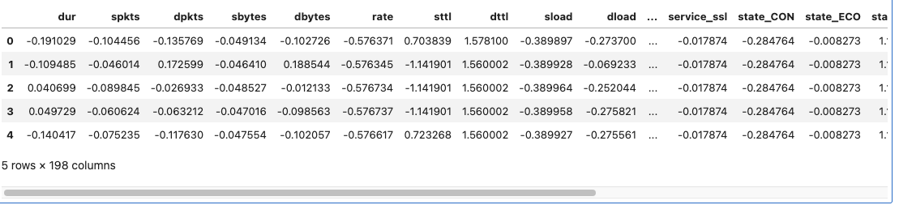

#### 2. Split Data into Train/Test Sets
* Paste the below code in new cell and Click Run. This code **loads** a preprocessed CSV dataset, splits it into **training** and **testing** sets, saves them as CSV for inspection, and converts them into **LIBSVM** format for use with Amazon SageMaker.
* **Note: SageMaker’s XGBoost** expects the label column as the first column, and no headers.
    ```python
    from sklearn.model_selection import train_test_split
    from sklearn.datasets import dump_svmlight_file
    import pandas as pd
    ​
    # Load data
    df = pd.read_csv('preprocessed_data.csv')
    X = df.drop(columns=['label'])
    y = df['label']
    ​
    # Split data
    X_train, X_test, y_train, y_test = train_test_split(
        X, y, test_size=0.2, random_state=42
    )
    ​
    # CSV for inspection
    train_df = pd.concat([y_train, X_train], axis=1)
    test_df = pd.concat([y_test, X_test], axis=1)
    train_df.to_csv('train.csv', index=False)
    test_df.to_csv('test.csv', index=False)
    ​
    # LIBSVM for SageMaker - fixed version
    dump_svmlight_file(X_train, y_train.values.ravel(), 'train.libsvm')
    dump_svmlight_file(X_test, y_test.values.ravel(), 'test.libsvm')
    ```

    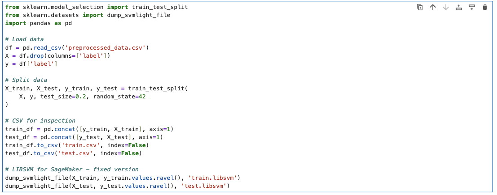

#### 3. Upload Training and Test Data to S3
* Paste the below code in new cell and Click Run. This code uploads the LIBSVM-formatted training and testing data files to specified paths in an S3 bucket for use with Amazon SageMaker.
    ```python
    import sagemaker
    ​
    session = sagemaker.Session()
    bucket = 'tparrish-cybersecurity-ml-data'
    train_prefix = 'xgboost-data/train'
    test_prefix = 'xgboost-data/test'
    ​
    train_input = session.upload_data('train.libsvm', bucket=bucket, key_prefix=train_prefix)
    test_input = session.upload_data('test.libsvm', bucket=bucket, key_prefix=test_prefix)
    ​
    print(f"Training data: {train_input}")
    print(f"Testing data: {test_input}")
    ```
    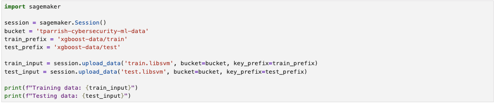
    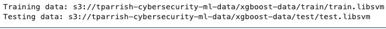

* Validate your S3 Bucket if the test & train folders got created under the ‘xgboost-data’ folder with respective files

    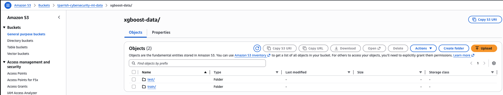
#### 4. Set Up the XGBoost Training Job
* Paste the below code in new cell and Click Run. This code configures an XGBoost estimator in SageMaker by retrieving the appropriate container image, setting training resources and output path, and specifying hyperparameters for a binary classification task.
    ```python
    from sagemaker import image_uris
    from sagemaker.estimator import Estimator
    ​
    xgboost_image_uri = image_uris.retrieve("xgboost", region=session.boto_region_name, version="1.3-1")
    ​
    xgb = Estimator(
        image_uri=xgboost_image_uri,
        role=sagemaker.get_execution_role(),
        instance_count=1,
        instance_type='ml.m5.large',
        output_path=f's3://tparrish-cybersecurity-ml-data/xgboost-model-output',
        sagemaker_session=session
    )
    ​
    xgb.set_hyperparameters(
        objective='binary:logistic',
        num_round=100,
        max_depth=5,
        eta=0.2,
        gamma=4,
        min_child_weight=6,
        subsample=0.8,
        verbosity=1
    )
    ```
    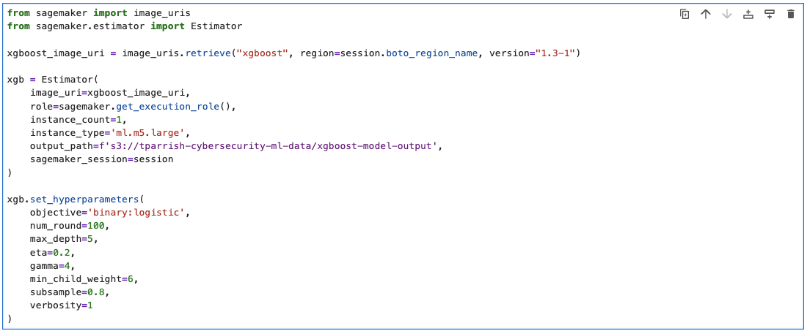
    
    
#### 5. Train the Model
* This code starts training the XGBoost model on SageMaker using the uploaded training and validation data from S3.
    ```python
    # Train using data channels
    xgb.fit({'train': train_input, 'validation': test_input})
    ```
    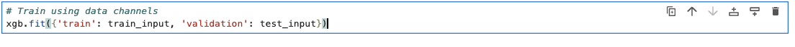
    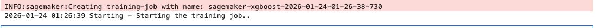    
    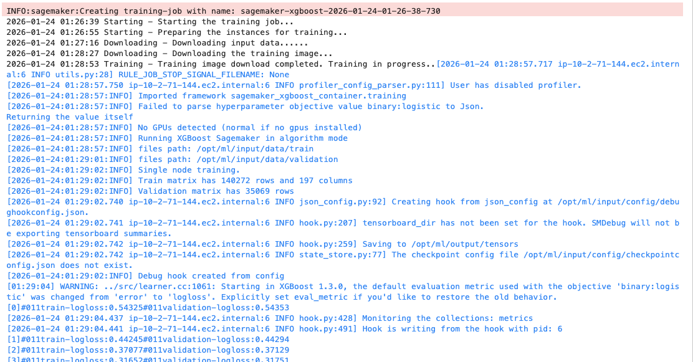
    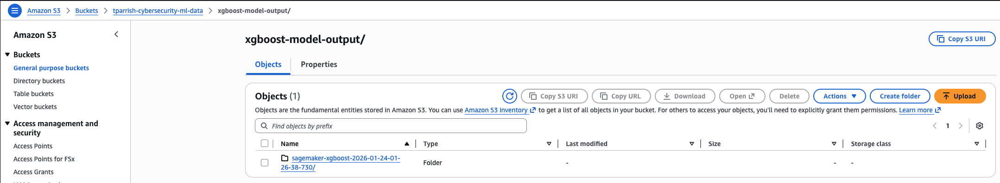

#### 6. Evaluate Model Performance
* Once training is complete, we’ll download the trained model, make predictions on test data, and calculate accuracy.
* Firstly we need to install **`xgboost`** Python package.

    ```bash
    !pip install --upgrade cmake - before installing xgboost, need to upgrade cmake
    ```
    ```bash
    !pip install xgboost==3.0.1
    ```
    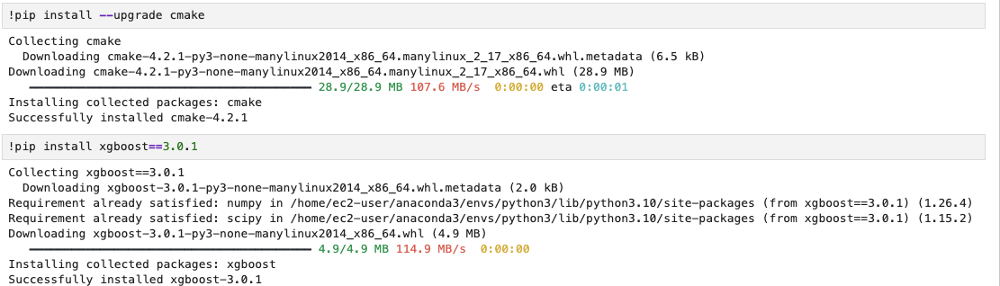

* Paste the below code in new cell and Click Run. This code trains an XGBoost model locally using the same parameters as the SageMaker model and evaluates its performance on the test set by computing accuracy and a classification report.
    ```python
    import pandas as pd
    import xgboost as xgb
    from sklearn.metrics import accuracy_score, classification_report
    ​
    # Load and convert data
    train_data = pd.read_csv('train.csv', header=None, dtype=str)
    test_data = pd.read_csv('test.csv', header=None, dtype=str)
    ​
    # Convert all columns to numeric
    train_data = train_data.apply(pd.to_numeric, errors='coerce')
    test_data = test_data.apply(pd.to_numeric, errors='coerce')
    ​
    # Drop any rows with NaNs
    train_data = train_data.dropna()
    test_data = test_data.dropna()
    ​
    # Split into features (X) and labels (y)
    X_train = train_data.iloc[:, 1:]
    y_train = train_data.iloc[:, 0]
    X_test = test_data.iloc[:, 1:]
    y_test = test_data.iloc[:, 0]
    ​
    # Convert to DMatrix format
    dtrain = xgb.DMatrix(X_train, label=y_train)
    dtest = xgb.DMatrix(X_test)
    ​
    # Set parameters and train the model
    params = {
        "objective": "binary:logistic",
        "max_depth": 5,
        "eta": 0.2,
        "gamma": 4,
        "min_child_weight": 6,
        "subsample": 0.8,
        "verbosity": 1
    }
    ​
    model = xgb.train(params=params, dtrain=dtrain, num_boost_round=100)
    ​
    # Predict
    y_pred_prob = model.predict(dtest)
    y_pred = [1 if p > 0.5 else 0 for p in y_pred_prob]
    ​
    # Evaluate
    print("Accuracy:", accuracy_score(y_test, y_pred))
    print("Classification Report:\n", classification_report(y_test, y_pred))
    ```

    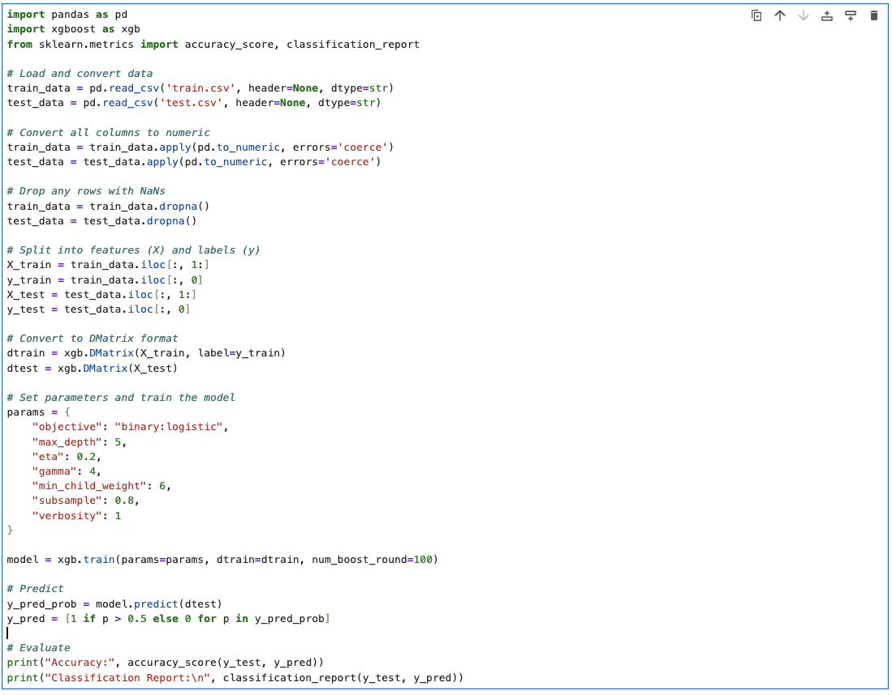

    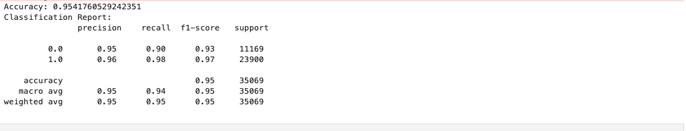

## 3. Deploy and Serve the Model
Deploy the trained model on Amazon SageMaker and expose it as an API endpoint for real-time cybersecurity threat detection.

**Task to be completed in this step** 
* [Create a SageMaker Model from the Trained Model Artifact](#1-create-a-sagemaker-model-from-the-trained-model-artifact)
* [Deploy the Model as a SageMaker Endpoint](#2-deploy-the-model-as-a-sagemaker-endpoint)
* [Test the Deployed Endpoint](#3-test-the-deployed-endpoint)

#### 1. Create a SageMaker Model from the Trained Model Artifact
* Paste the below code in new cell and Click Run. Before deployment, we register the trained model in SageMaker.
    ```python
    import boto3
    from sagemaker import image_uris
    ​
    sagemaker_client = boto3.client("sagemaker")
    region = "us-east-1"
    bucket_name = "tparrish-cybersecurity-ml-data"
    model_artifact = f"s3://tparrish-cybersecurity-ml-data/xgboost-model-output/sagemaker-xgboost-2026-01-24-01-26-38-730/output/model.tar.gz"
    model_name = "cybersecurity-threat-xgboost"
    ​
    # Get XGBoost image URI
    image_uri = image_uris.retrieve("xgboost", region=region, version="1.3-1")
    ​
    # Use actual IAM Role ARN
    execution_role = "arn:aws:iam::421613839447:role/SageMakerCybersecurityRole"
    ​
    # Register the model
    response = sagemaker_client.create_model(
        ModelName=model_name,
        PrimaryContainer={
            "Image": image_uri,
            "ModelDataUrl": model_artifact
        },
        ExecutionRoleArn=execution_role
    )
    ​
    print(f"Model {model_name} registered successfully in SageMaker!")
    ```

    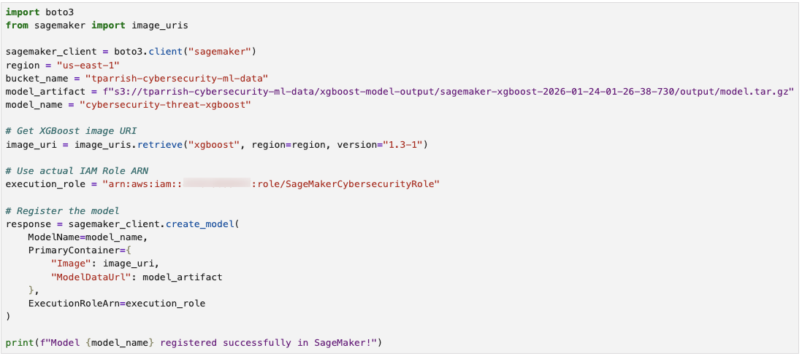

    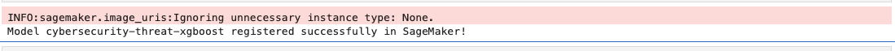

#### 2. Deploy the Model as a SageMaker Endpoint
* Paste the below code in new cell and Click Run. We now create a real-time endpoint that applications can call for cybersecurity threat detection.
    ```python
    # Define model name if not already defined
    model_name = "cybersecurity-threat-xgboost"
    ​
    # Define endpoint configuration
    endpoint_config_name = "cybersecurity-threat-config"
    ​
    sagemaker_client.create_endpoint_config(
        EndpointConfigName=endpoint_config_name,
        ProductionVariants=[
            {
                "VariantName": "DefaultVariant",
                "ModelName": model_name,
                "InstanceType": "ml.m5.large",
                "InitialInstanceCount": 1,
                "InitialVariantWeight": 1
            }
        ]
    )
    ​
    # Deploy endpoint
    endpoint_name = "cybersecurity-threat-endpoint"
    ​
    sagemaker_client.create_endpoint(
        EndpointName=endpoint_name,
        EndpointConfigName=endpoint_config_name
    )
    ​
    print(f"Endpoint '{endpoint_name}' is being deployed. This may take a few minutes...")
    ```
    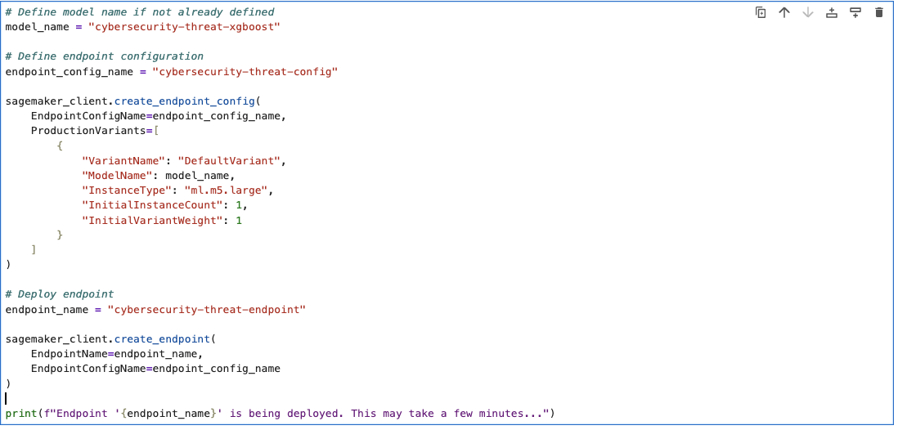
    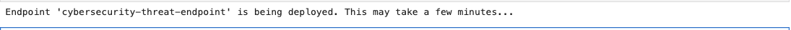
    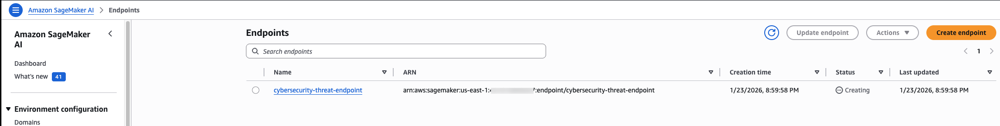
    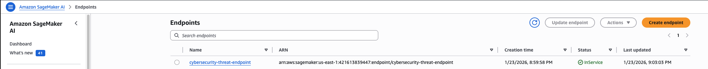

#### 3. Test the Deployed Endpoint
* Once the endpoint is active, we send a sample request to check if it correctly detects threats.
    ```python
    import boto3
    import numpy as np
    ​
    runtime_client = boto3.client("sagemaker-runtime")
    ​
    # Sample input in CSV format
    sample_input = "0.5,0.3,0.8,0.2,0.1,0.6,0.9,0.4"
    ​
    # Invoke the endpoint
    response = runtime_client.invoke_endpoint(
        EndpointName="cybersecurity-threat-endpoint",  # or use endpoint_name if defined
        ContentType="text/csv",
        Body=sample_input
    )
    ​
    # Get prediction from response
    result = response["Body"].read().decode("utf-8")
    prediction_score = float(result.strip())
    ​
    # Interpret prediction
    predicted_label = "THREAT" if prediction_score > 0.5 else "SAFE"
    ​
    print(f"Prediction: {predicted_label}")
    ```
    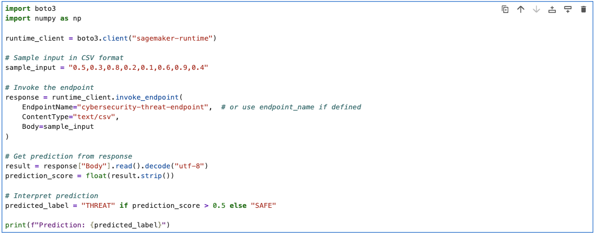
    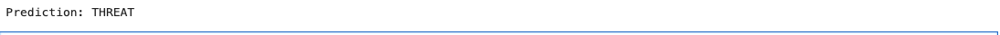

## 4. Automating with SageMaker Pipelines
This step connects all the earlier parts of our project into one automated, production-grade ML workflow. It automates the entire machine learning workflow, including data preprocessing, training, evaluation, and deployment using Amazon SageMaker Pipelines.
It transitions our project from: Manual development/testing to Automated pipeline orchestration using Amazon SageMaker Pipelines, Lambda, and EventBridge.

Amazon SageMaker Pipelines is a workflow automation tool that helps:
* Streamline data preprocessing, model training, and deployment.
* Maintain version control for models.
* Automate model retraining when new data arrives.

**Task to be completed in this step** 
* [Define the SageMaker Pipeline Workflow](#1-define-the-sagemaker-pipeline-workflow)
* [Create a SageMaker Pipeline Definition](#2-create-a-sagemaker-pipeline-definition)
* [Trigger the Pipeline Execution](#3-trigger-the-pipeline-execution)
* [Automate Retraining with AWS EventBridge](#4-automate-retraining-with-aws-eventbridge)
* [Test the Automation](#5-test-the-automation)

#### 1. Define the SageMaker Pipeline Workflow
#### 2. Create a SageMaker Pipeline Definition
#### 3. Trigger the Pipeline Execution
#### 4. Automate Retraining with AWS EventBridge
#### 5. Test the Automation

## ☁️ AWS Architecture


## &rarr; Final Result