# Cybersecurity Threat Detection 

## 🌟 Overview
This project involves building and deploying a **Cybersecurity Threat Detection System using Amazon SageMaker**. The system identifies anomalous network activity that may indicate cyberattacks, such as DDoS attacks, unauthorized access, or phishing attempts. The machine learning pipeline automates data ingestion, preprocessing, model training, deployment, and inference.

#### **Key components include:**

* **Data Ingestion & Preprocessing**: Raw network traffic logs are collected, transformed, and feature-engineered to create a structured dataset.
* **Model Training & Evaluation**: An XGBoost model is trained to classify network activity as normal or malicious.
* **Deployment & Inference**: The trained model is deployed as an endpoint to detect real-time security threats.
* **Pipeline Automation**: An end-to-end SageMaker Pipeline automates data transformation, model training, and deployment.

## 🛠️ Services used
* **Amazon SageMaker**: Trains, deploys, and serves the machine learning model. **[Machine Learning]**
* **Amazon S3**: Stores raw network traffic logs, preprocessed data, and model artifacts. **[Storage]**
* **AWS Lambda**: Automates data preprocessing tasks and feature extraction. **[Compute]**
* **Amazon CloudWatch**: Monitors model performance and logs security threats. **[Monitoring]**
* **AWS IAM**: Manages permissions and security policies for accessing AWS services. **[Security]**

## Outline of the steps to complete this project
1. [Preprocess Data and Feature Engineering](#1-preprocess-data-and-feature-engineering)
2. [Training and Testing a Model using XGBoost](#2-training-and-testing-a-model-using-xgboost)
3. [Deploy and Serve the Model](#3-deploy-and-serve-the-model)
4. [Automating with SageMaker Pipelines](#4-automating-with-sagemaker-pipelines)

## 1. Preprocess Data and Feature Engineering
Prepare network traffic data to train a machine learning model for cybersecurity threat detection. Setup AWS environment to fetch public dataset, clean the data, engineer meaningful features, and save the processed data for training. This is a critical step, high-quality input leads to a reliable and accurate model.

**Task to be completed in this step** 
* [Create an IAM Role for SageMaker](#1-create-an-iam-role-for-sagemaker)
* [Set Up Amazon SageMaker Notebook Instance](#2-set-up-amazon-sagemaker-notebook-instance)
* [Download & Upload a Public Dataset to S3](#3-download--upload-a-public-dataset-to-s3)
* [Load & Explore the Dataset in SageMaker](#4-load--explore-the-dataset-in-sagemaker)
* [Clean, Feature Engineer, Encode, and Normalize Data](#5-clean-feature-engineer-encode-and-normalize-data)
* [Save the Preprocessed Data to S3](#6-save-the-preprocessed-data-to-s3)

#### 1. Create an IAM Role for SageMaker
* Navigate to **IAM console** and create a role called **SageMakerCybersecurityRole**
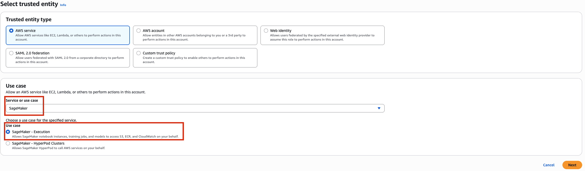
* Make sure the **SageMakerCybersecurityRole** has **AmazonSageMakerFullAccess** and **AmazonS3FullAccess**
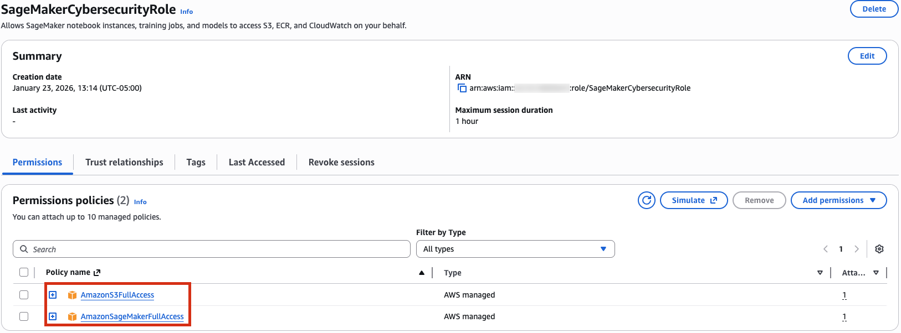
* This gives **SageMaker** the permissions required to access the **S3 bucket**

#### 2. Set up Amazon SageMaker Notebook Instance
* Navigate to **Amazon SageMaker AI**

    
* Create **notebook instance**
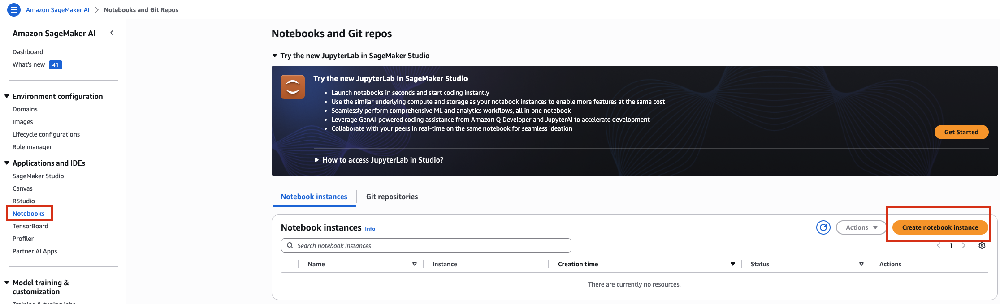
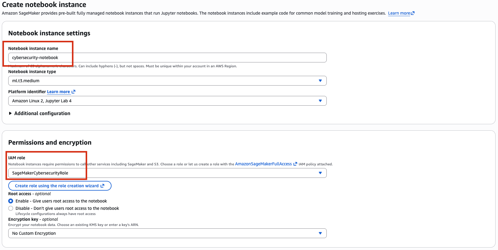
* Create notebook instance and make sure the status InService, then click the Open Jupyter button
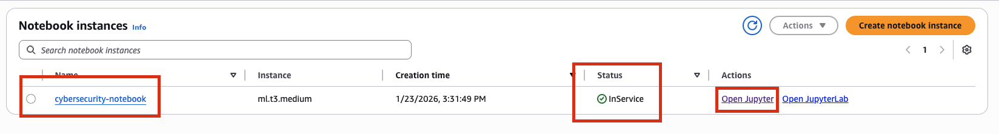

#### 3. Download & Upload a Public Dataset to S3
* **UNSW_NB15_training-set.csv** is a real-world data public dataset from UNSW-NB15 for threat detection, which contains normal and malicious network activities.
* Navigate to the S3 console and create a bucket.  Leave all other settings as default.

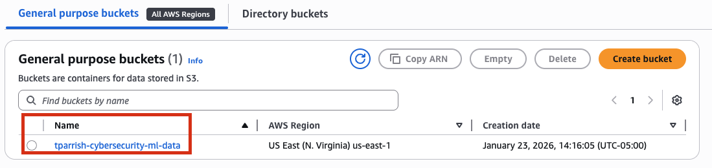
* Navigate into the bucket that was just created and create a folder called raw-data.

* Upload **UNSW_NB15_training-set.csv** to the raw-data folder.
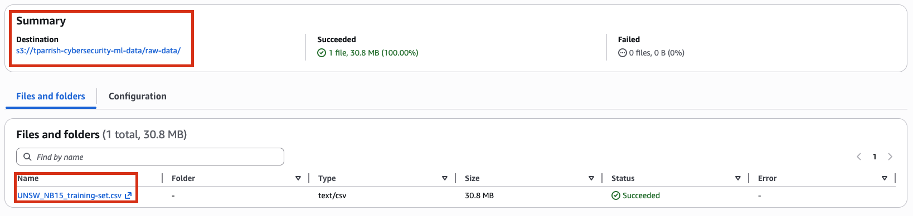
* Before processing the data, we need to understand it. What features exist, how many records there are, and whether labels are balanced.

    ```python
    import boto3
    import pandas as pd
    import io
    ​  
    # Setup S3 client
    s3_client = boto3.client('s3')
    ​
    # Bucket name
    bucket = 'tparrish-cybersecurity-ml-data'

    # Download the file into memory
    response = s3_client.get_object(Bucket=bucket, Key='raw-data/UNSW_NB15_training-set.csv')
    ​
    # Read it into pandas
    df = pd.read_csv(io.BytesIO(response['Body'].read()))
    ​
    # Explore
    print(df.shape)
    print(df.columns)
    print(df.head())
    print(df['label'].value_counts())
    ```

#### 4. Load & Explore the Dataset in SageMaker
* Create a new notebook file

    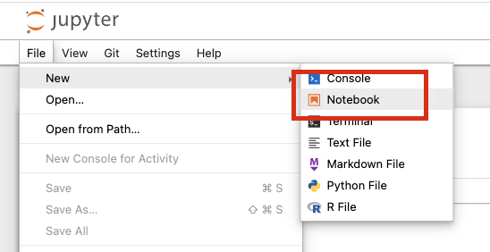
* Select conda_python3 as the kernel

    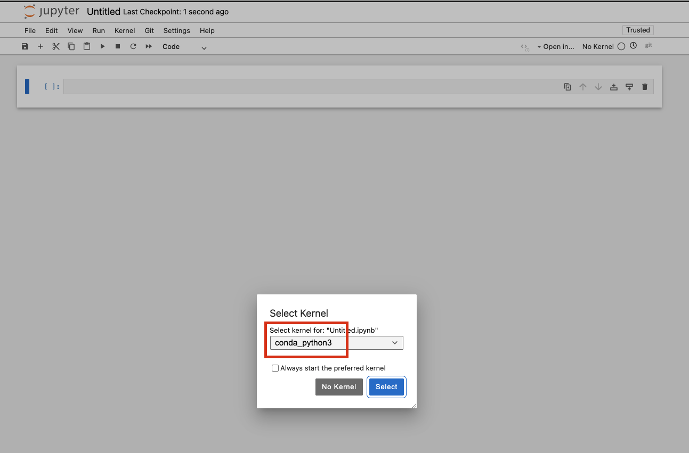
* Rename the file to data_preprocessing.ipynb

    
* File name changed to data_preprocessing.ipynb

    
* Paste the code below in data_preprocessing.ipynb:
    ```python
    import boto3
    import pandas as pd
    import io
    ​  
    # Setup S3 client
    s3_client = boto3.client('s3')
    ​
    # Bucket name
    bucket = 'tparrish-cybersecurity-ml-data'

    # Download the file into memory
    response = s3_client.get_object(Bucket=bucket, Key='raw-data/UNSW_NB15_training-set.csv')
    ​
    # Read it into pandas
    df = pd.read_csv(io.BytesIO(response['Body'].read()))
    ​
    # Explore
    print(df.shape)
    print(df.columns)
    print(df.head())
    print(df['label'].value_counts())
    ```


#### 5. Clean, Feature Engineer, Encode, and Normalize Data
#### 6. Save the Preprocessed Data to S3

## 2. Training and Testing a Model using XGBoost
Train a machine learning model (using XGBoost) to classify whether a given network activity is normal or malicious, based on the features extracted in Step 1. Use Amazon SageMaker’s built-in XGBoost algorithm, which makes training efficient and scalable.

**Task to be completed in this step** 
* [Load Preprocessed Data from S3](#1-load-preprocessed-data-from-s3)
* [Split Data into Train/Test Sets](#2-split-data-into-traintest-sets)
* [Upload Training and Test Data to S3](#3-upload-training-and-test-data-to-s3)
* [Set Up the XGBoost Training Job](#4-set-up-the-xgboost-training-job)
* [Train the Model](#5-train-the-model)
* [Evaluate Model Performance](#6-evaluate-model-performance)

#### 1. Load Preprocessed Data from S3
#### 2. Split Data into Train/Test Sets
#### 3. Upload Training and Test Data to S3
#### 4. Set Up the XGBoost Training Job
#### 5. Train the Model
#### 6. Evaluate Model Performance

## 3. Deploy and Serve the Model
Deploy the trained model on Amazon SageMaker and expose it as an API endpoint for real-time cybersecurity threat detection.

**Task to be completed in this step** 
* [Create a SageMaker Model from the Trained Model Artifact](#1-create-a-sagemaker-model-from-the-trained-model-artifact)
* [Deploy the Model as a SageMaker Endpoint](#2-deploy-the-model-as-a-sagemaker-endpoint)
* [Test the Deployed Endpoint](#3-test-the-deployed-endpoint)

#### 1. Create a SageMaker Model from the Trained Model Artifact
#### 2. Deploy the Model as a SageMaker Endpoint
#### 3. Test the Deployed Endpoint

## 4. Automating with SageMaker Pipelines
This step connects all the earlier parts of our project into one automated, production-grade ML workflow. It automates the entire machine learning workflow, including data preprocessing, training, evaluation, and deployment using Amazon SageMaker Pipelines.
It transitions our project from: Manual development/testing to Automated pipeline orchestration using Amazon SageMaker Pipelines, Lambda, and EventBridge.


What is Amazon SageMaker Pipelines?

Amazon SageMaker Pipelines is a workflow automation tool that helps:

Streamline data preprocessing, model training, and deployment.
Maintain version control for models.
Automate model retraining when new data arrives.


**Task to be completed in this step** 
* [Define the SageMaker Pipeline Workflow](#1-define-the-sagemaker-pipeline-workflow)
* [Create a SageMaker Pipeline Definition](#2-create-a-sagemaker-pipeline-definition)
* [Trigger the Pipeline Execution](#3-trigger-the-pipeline-execution)
* [Automate Retraining with AWS EventBridge](#4-automate-retraining-with-aws-eventbridge)
* [Test the Automation](#5-test-the-automation)

#### 1. Define the SageMaker Pipeline Workflow
#### 2. Create a SageMaker Pipeline Definition
#### 3. Trigger the Pipeline Execution
#### 4. Automate Retraining with AWS EventBridge
#### 5. Test the Automation


<!-- #### Create SageMaker role and add AmazonS3FullAccess policy
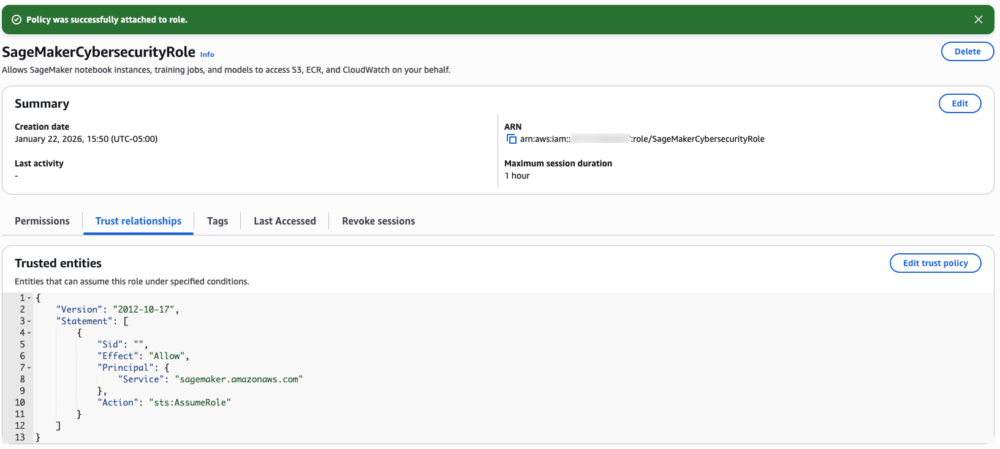
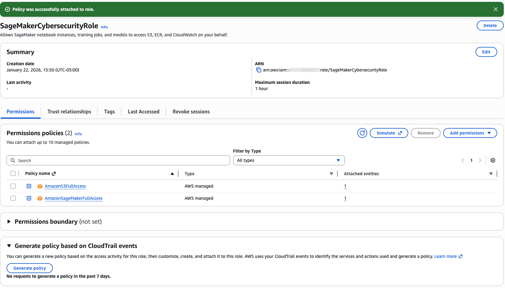
#### Navigate to the sagemaker-ai
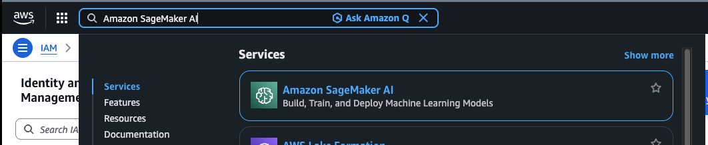
#### Create cybersecurity-notebook, click Open Jupyter after status is InsService
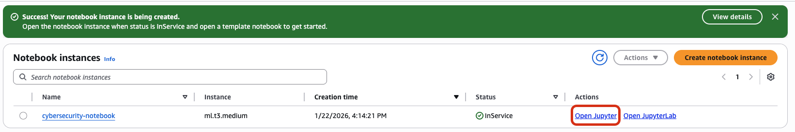
#### Create bucket and store UNSW_NB15_training-set.csv in s3://cybersecurity-ml-data-demo/raw-data/
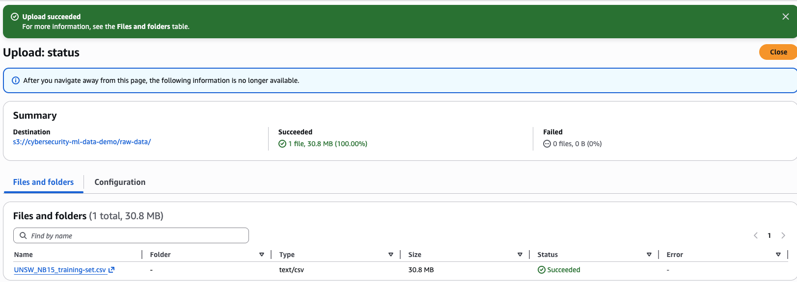
#### After running
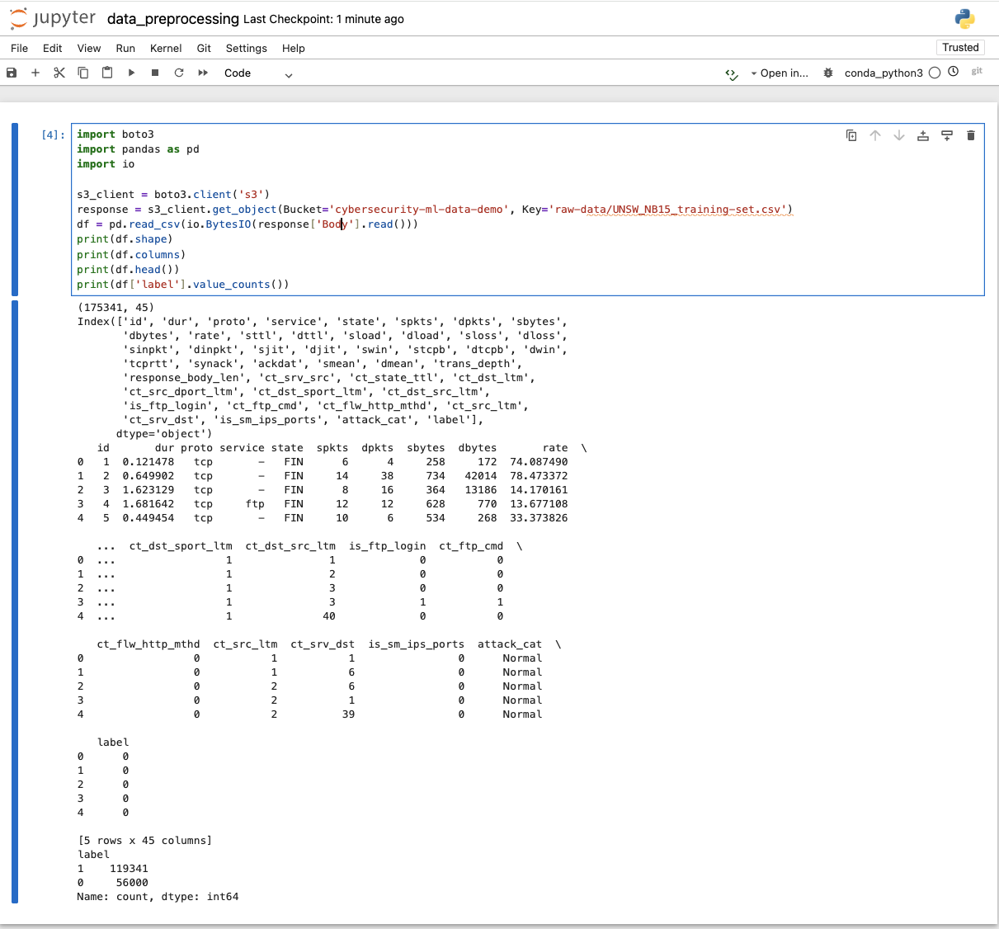
## ☁️ AWS Architecture


## &rarr; Final Result


pip install --upgrade cmake
!pip install xgboost==3.0.1 -->


